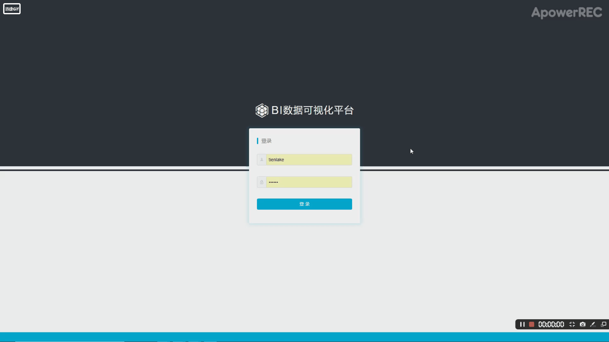
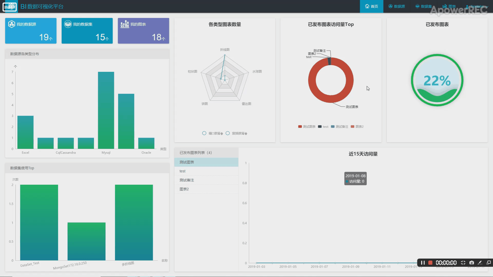
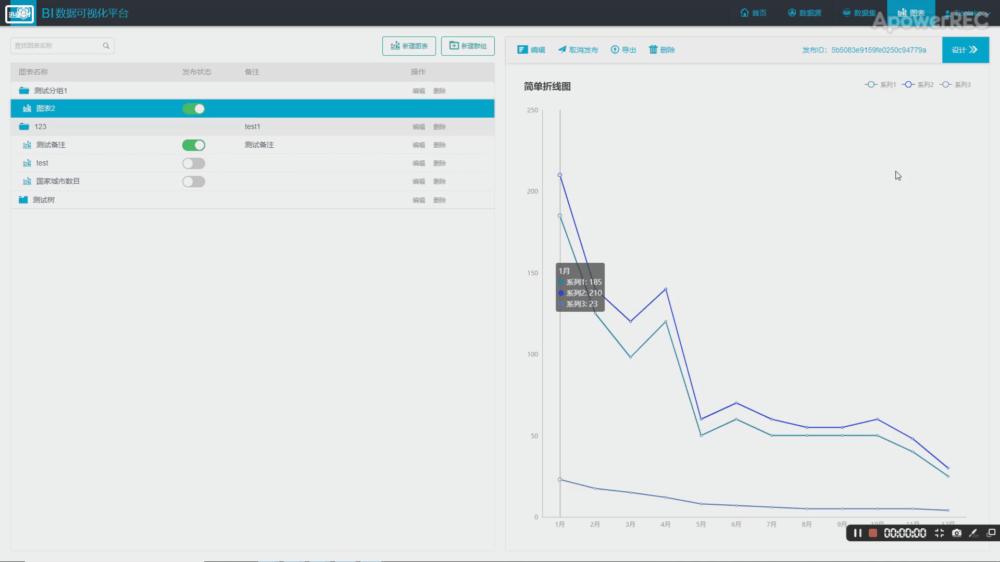

# Business Intelligence Data Visualization

This is a Business Intelligence Data Visualization system based on multiple data sources. Generally, rules or information mined in big data are stored in database, and them are visualized through a visualization platform. It is such a visualization platform. It supports the visualization of data in a variety of data source, such as Mysql, Oracle, MongoDB, Cassandra, File, etc.

<table>

<tr>

<td><b>Chinese Documentation:</b></td>
<td><a href="resources/README.cn.md">中文文档</a></td>

  </tr>

</table>

## Getting Started

Next, the core functions of the system are demonstrated through a set of animations.

- Login system

  

- Connect data source and import data

  

- Data visualization

  

## My Responsibilities

- Implemented visualization support for data in Cassandra for the system by using Spark SQL computing framework.
- Optimized connection provider instance to decrease database connection request response time by approximately 50% for the system by using HikariCP connection pool and Singleton pattern.

