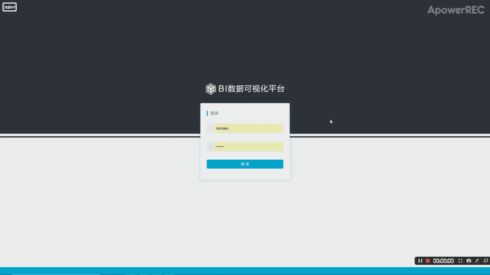
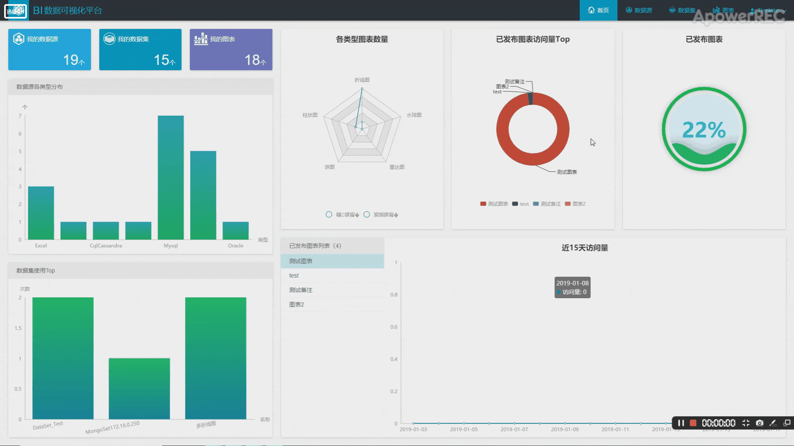
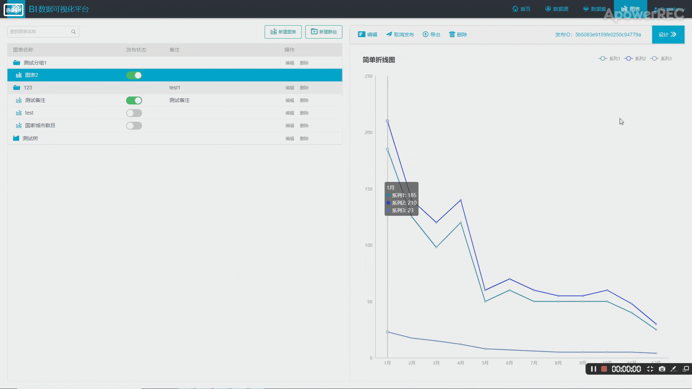

# Business Intelligence Data Visualization

这是一个可以为多种数据源中数据提供可视化的数据可视化系统。其支持的数据数据源类型包括Mysql, Oracle, MongoDB, Cassandra和File等。并且具有很好地可扩展性，后期支持更多的数据源。

## 项目演示

- 登录模块

  

- 连接数据源并导入数据

  

- 数据可视化

  

## 我的工作

- 通过采用Spark SQL大数据计算框架为系统添加了对Cassandra数据源中数据可视化的支持。
- 采用HikariCP连接池优化了数据连接管理模块创建连接的相应时长。